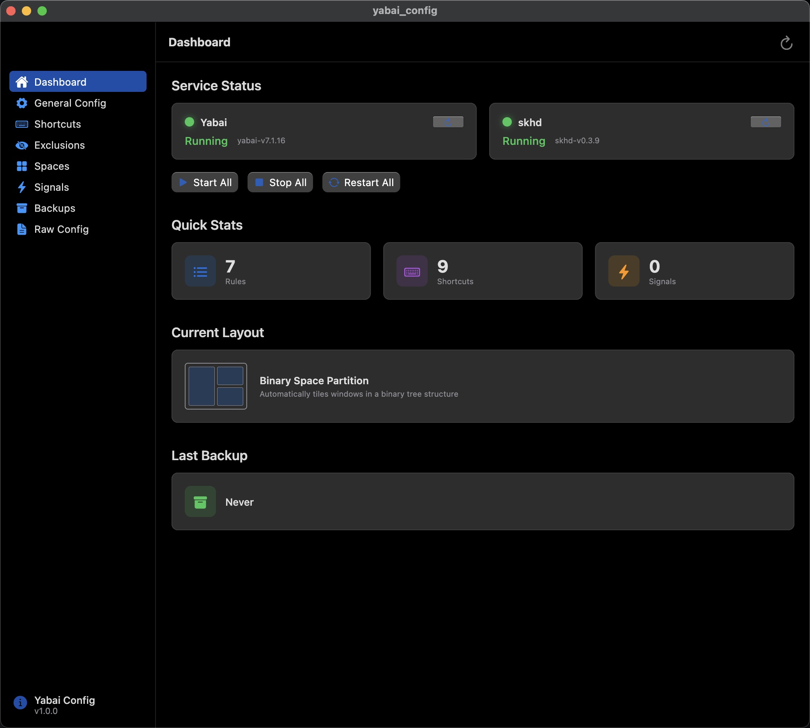
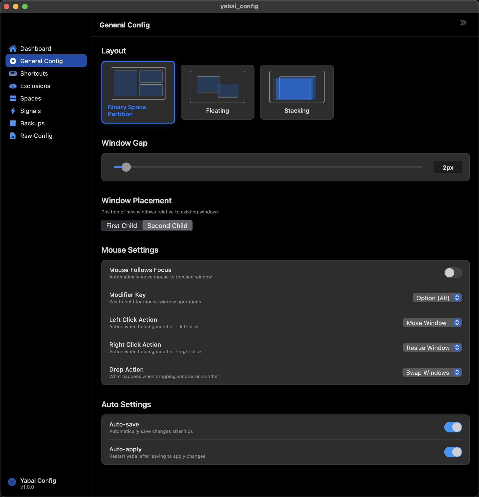
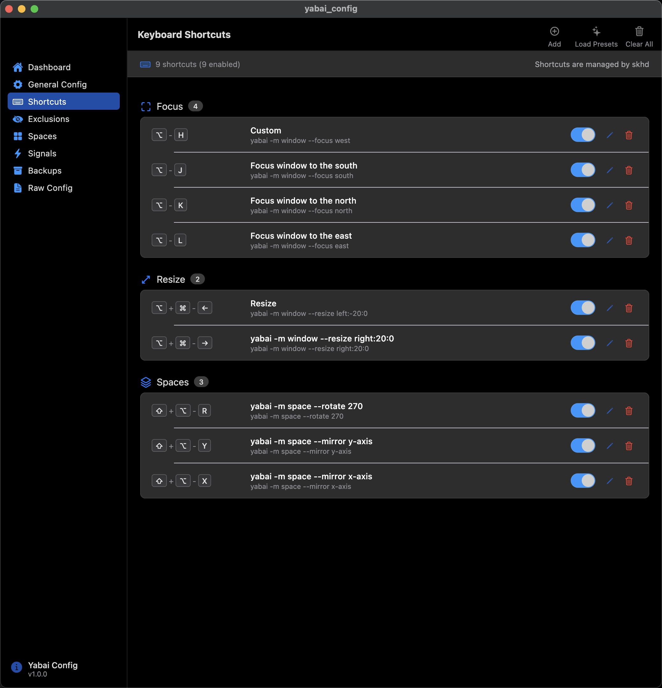
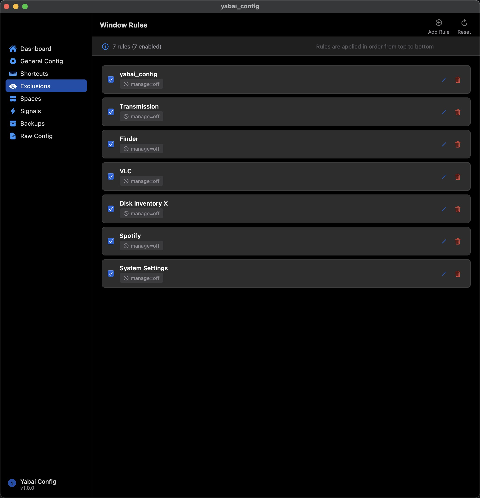
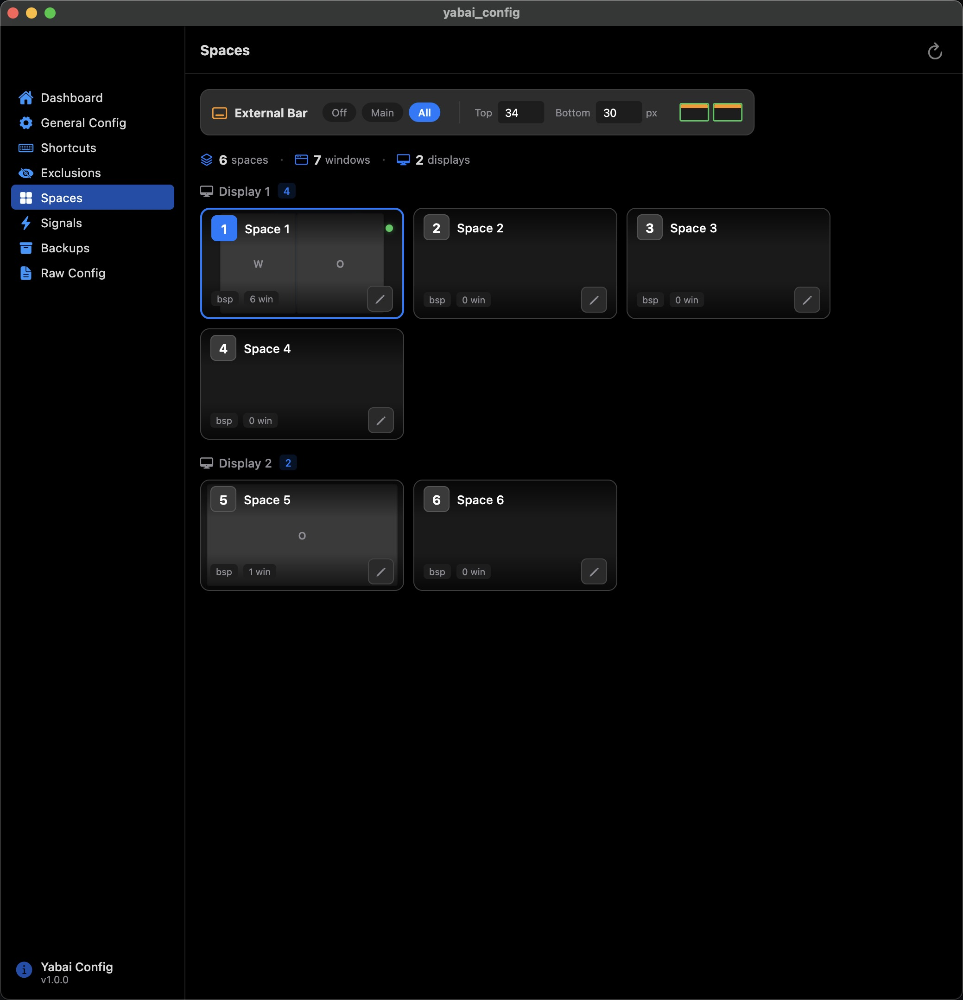
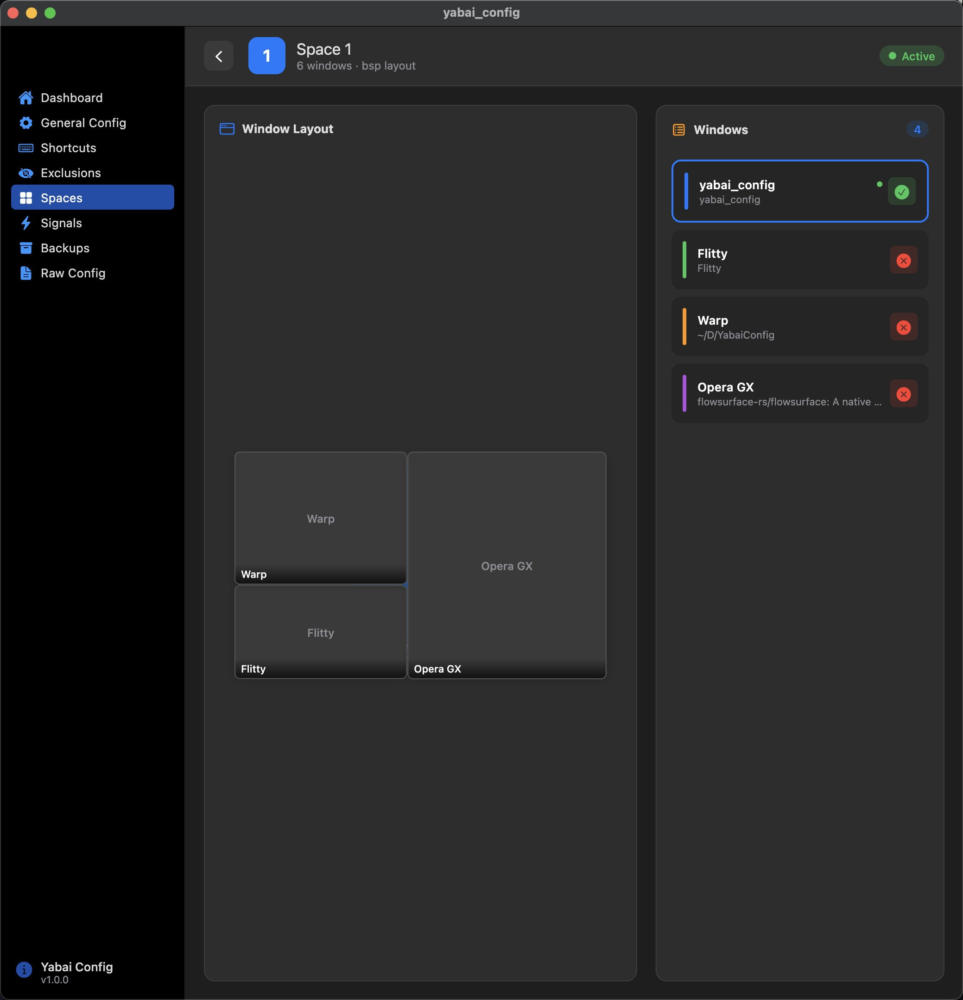
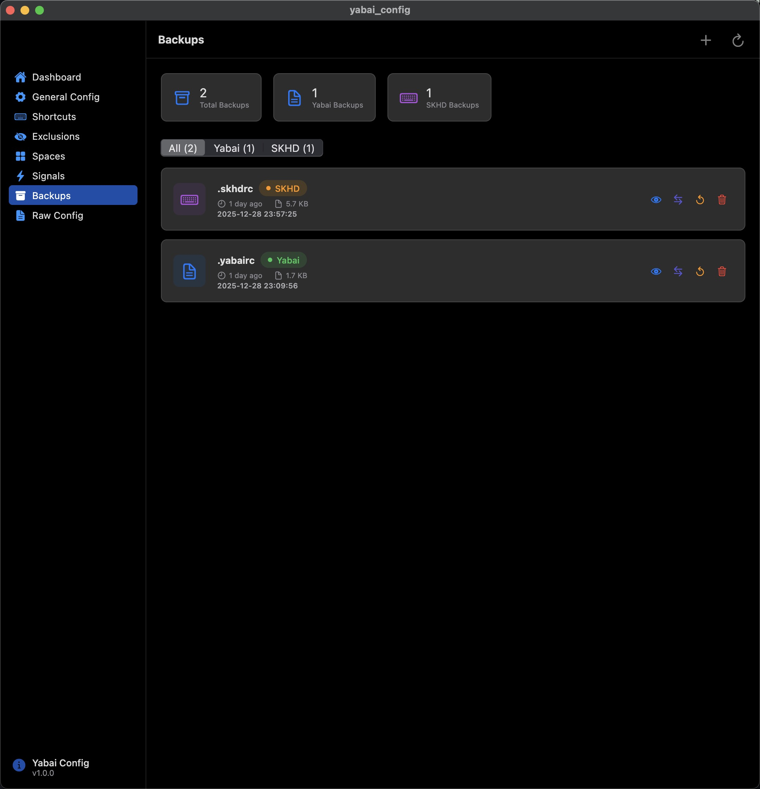
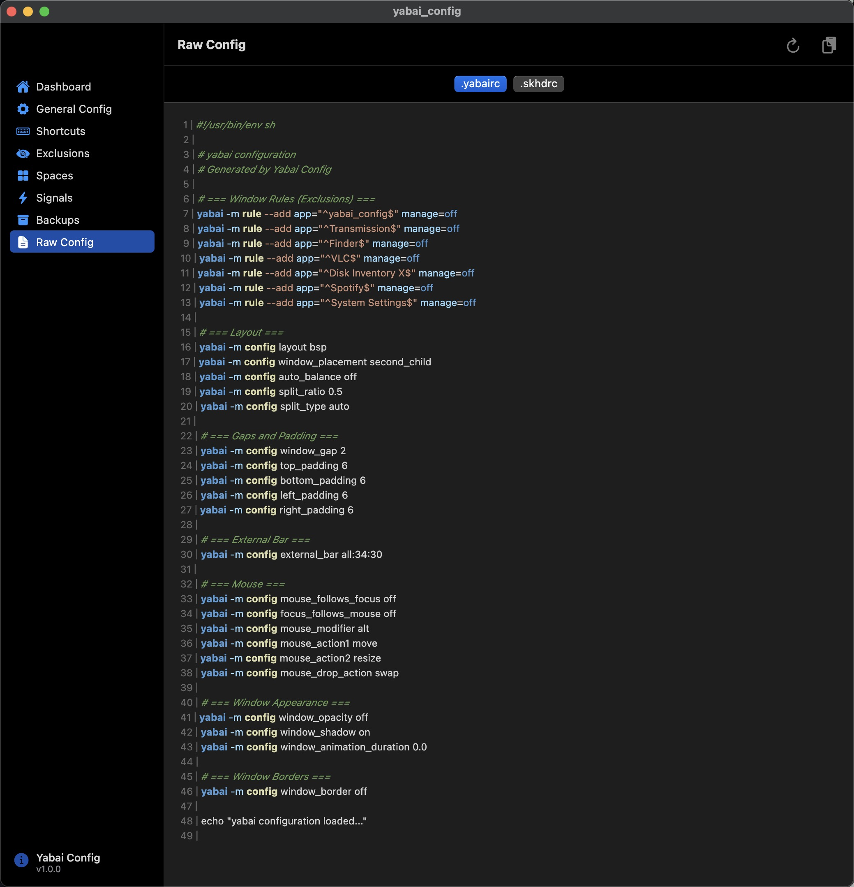

# Yabai Config

<p align="center">
  
</p>

A native macOS application built with Flutter that provides a visual configuration interface for [Yabai](https://github.com/koekeishiya/yabai) tiling window manager and [skhd](https://github.com/koekeishiya/skhd) hotkey daemon.

## Features

### Implemented

- **Dashboard** - Service status monitoring for Yabai and skhd with quick start/stop/restart controls
- **General Configuration** - Visual editor for all Yabai settings (layout, gaps, padding, mouse behavior, focus follows mouse, etc.)
- **Keyboard Shortcuts** - Visual skhd shortcut manager with key recording
- **Window Exclusions** - Manage apps and windows that should be excluded from tiling
- **Spaces Management** - View and configure per-space settings, see windows in each space
- **Signals** - Configure Yabai signals for automation
- **Backups** - Create and restore configuration backups
- **Raw Config** - Direct editor for `.yabairc` and `.skhdrc` files

### Planned / In Progress

- [ ] Window thumbnails preview (requires Screen Recording permission)
- [ ] Code signing for seamless Finder/Spotlight launch
- [ ] Menu bar integration
- [ ] Configuration templates/presets
- [ ] Import/export configurations

## Requirements

- macOS 10.15 (Catalina) or later
- [Yabai](https://github.com/koekeishiya/yabai) installed
- [skhd](https://github.com/koekeishiya/skhd) installed

## Installation

1. Download the latest release from the [Releases](https://github.com/avillagran/yabai_config.app/releases) page
2. Unzip and move `yabai_config.app` to `/Applications`
3. **Important:** Remove the quarantine attribute (required for unsigned apps):
   ```bash
   xattr -cr /Applications/yabai_config.app
   ```
4. Launch the app:
   ```bash
   open /Applications/yabai_config.app
   ```

> **Note:** Due to macOS security restrictions, the app may not open from Finder or Spotlight. Use the terminal command above to launch it, or create an Automator app/Alfred workflow.

## Building from Source

### Prerequisites

- Flutter SDK 3.19.5+ (managed via [FVM](https://fvm.app/))
- Xcode 15+
- macOS

### Build

```bash
# Clone the repository
git clone https://github.com/avillagran/yabai_config.app.git
cd yabai_config.app

# Install dependencies
fvm flutter pub get

# Run in development
fvm flutter run -d macos

# Build release
fvm flutter build macos --release
```

The release build will be at `build/macos/Build/Products/Release/yabai_config.app`

## Tech Stack

- **Framework:** Flutter (macOS)
- **State Management:** Riverpod
- **UI:** macos_ui (native macOS widgets)

## Screenshots

### Dashboard


### General Configuration


### Keyboard Shortcuts


### Window Exclusions


### Spaces Management


### Space Detail


### Backups


### Raw Config Editor


## Contributing

Contributions are welcome! Please feel free to submit a Pull Request.

## Support the Project

If you find this project useful, consider buying me a coffee:

**Bitcoin:** `bc1qy0p3c082d59tm467qfwn0w6d82flxrn9a7ngfh`

**Lightning:** `avillagran@strike.me`

## License

MIT License - see [LICENSE](LICENSE) for details.

---

**Current Version:** v0.1.0

## Acknowledgments

- [Yabai](https://github.com/koekeishiya/yabai) by koekeishiya
- [skhd](https://github.com/koekeishiya/skhd) by koekeishiya
- [macos_ui](https://pub.dev/packages/macos_ui) Flutter package
